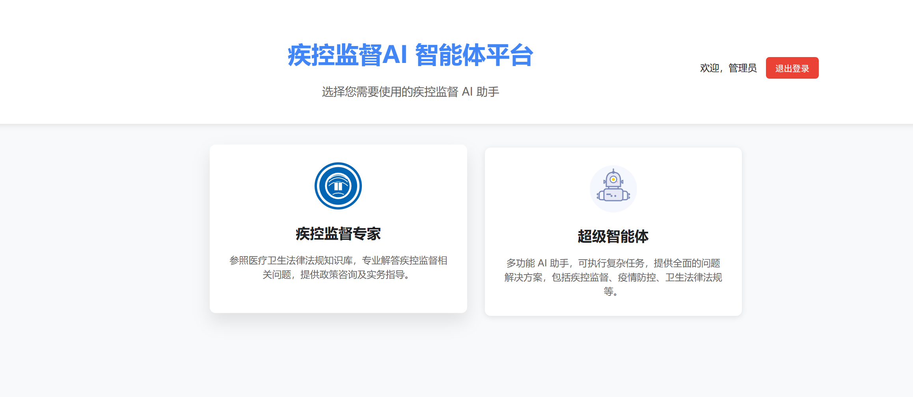
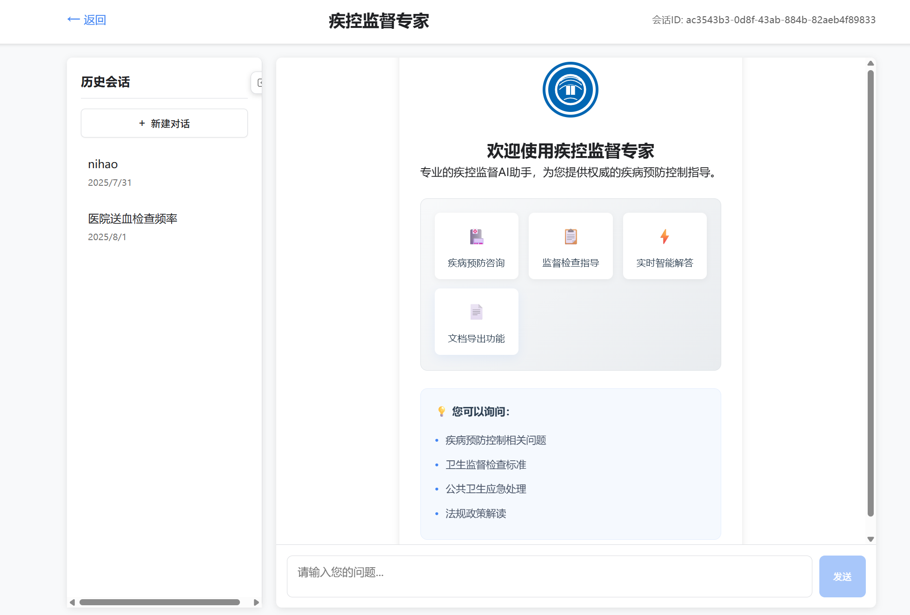
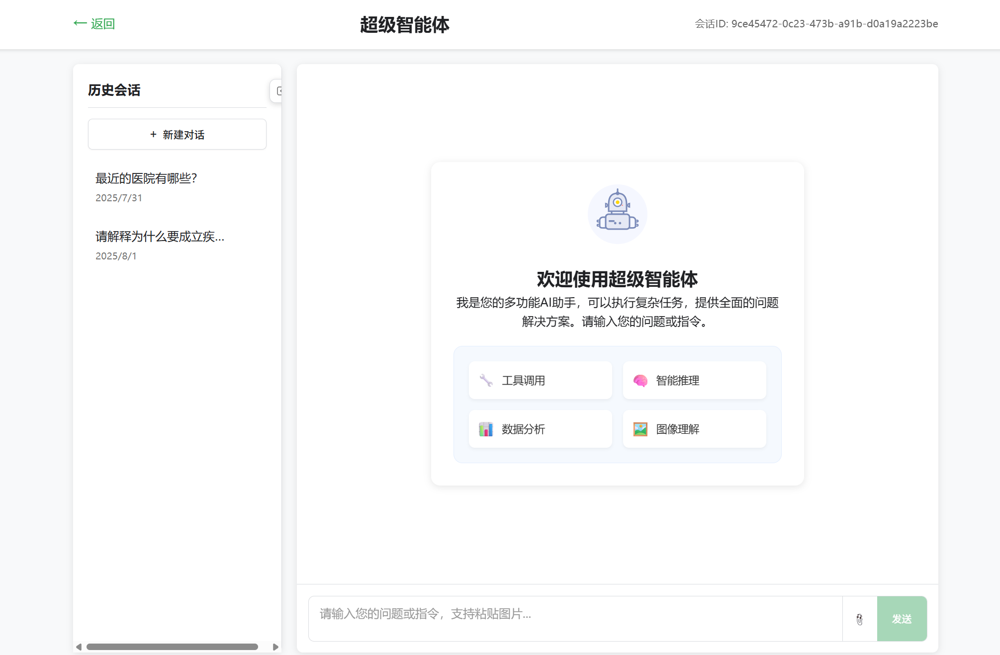
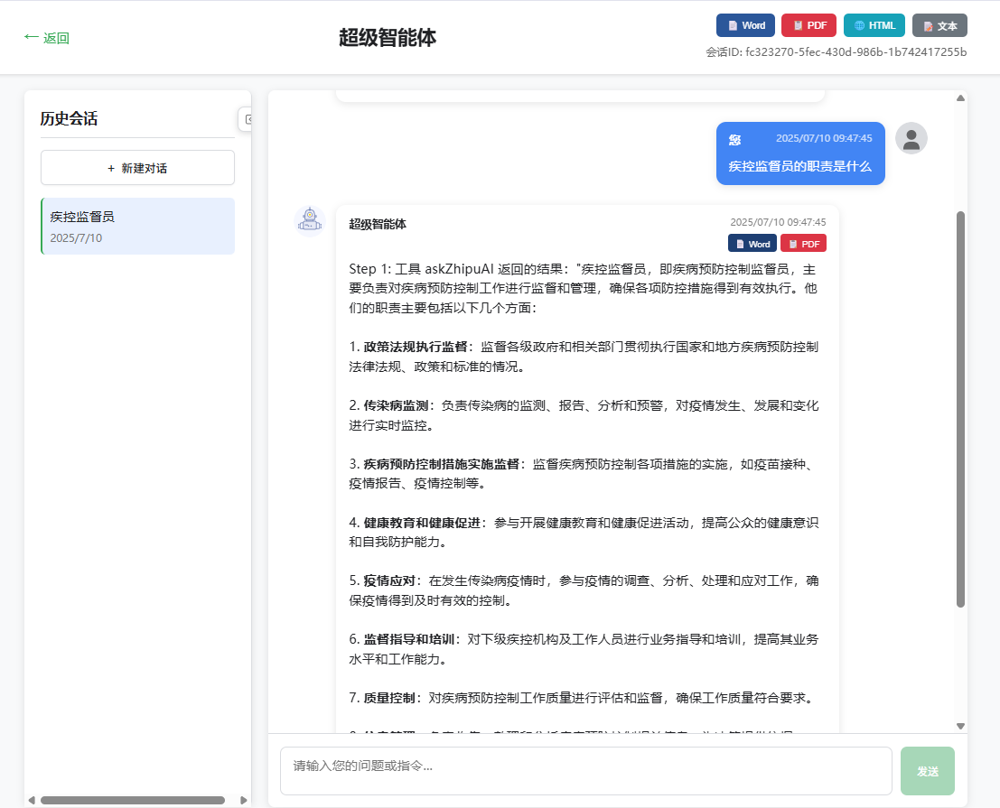
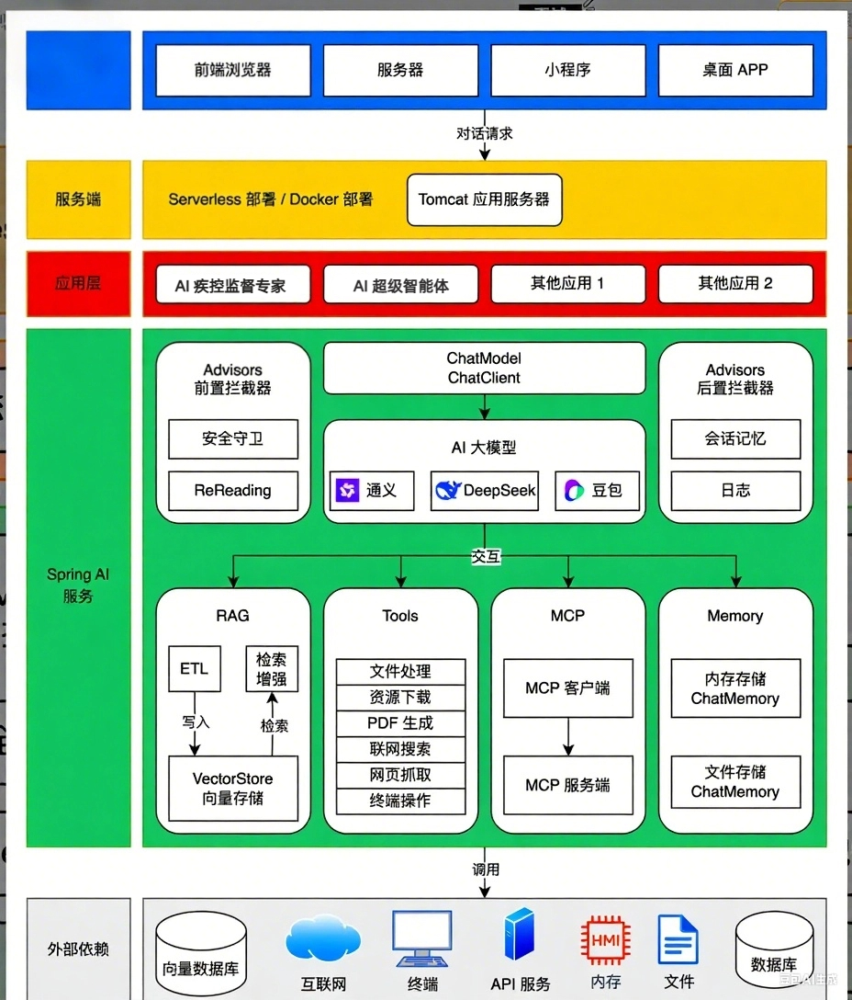

# AI疾控监督智能体
**在线演示地址**: [http://zklaiagent.top/](http://zklaiagent.top/)

---
# superAiAgent

## 项目背景
随着全球公共卫生事件的频发，疾控监督的智能化需求日益增长。本智能体通过AI技术实现疫情动态监控、风险预警、知识问答及自动化报告生成，旨在提升疾控响应效率与决策精准度，适用于政府机构、医疗机构及公众健康管理场景。

---

## 项目功能梳理
### 核心功能模块
1. **智能对话服务**
    - 支持自然语言交互的疾控知识问答（如症状咨询、防控政策解读）。
   
2. **数据增强检索（RAG）**
    - 从向量库快速检索最新疾控指南、学术论文等结构化数据。
3. **多平台接入**
    - 兼容浏览器、小程序、桌面APP等多终端请求。
4. **工具链集成**
    - 文件处理（PDF报告生成）、联网搜索（实时疫情数据抓取）、终端操作（本地数据分析）。
   
5. **记忆与会话管理**
    - 基于内存/文件的对话历史存储，支持长期追踪用户咨询记录。
    - 文件导出
      - 
6. **安全守卫**：前置拦截器验证请求权限，后置拦截器过滤敏感信息。
7. **日志系统**：记录模型调用、用户行为等数据供审计分析。


## 技术选型
- Spring Al + LangChain4j
- RAG 知识库
- PGvector 向量数据库
- Tool Calling 工具调用
- MCP 模型上下文协议
- ReAct Agent 智能体构建
- Serverless 计算服务
- AI 大模型开发平台百炼
- Cursor AI代码生成
- SSE 异步推送

| 模块            | 技术栈                    | 说明                               |
|-----------------|------------------------|----------------------------------|
| **前端层**      | 跨平台框架（Vue+Axios）       | 适配浏览器、小程序、桌面端。                   |
| **服务部署**    | Serverless/Docker      | 弹性扩缩容，Tomcat备用传统部署。              |
| **AI核心**      | Spring AI + 多模型代理（MCP） | 通义、DeepSeek模型，ChatClient标准化接口调用。 |
| **向量存储**    | VectorStore            | 支持疾控知识的高效检索与RAG增强。               |
| **工具集成**    | 自定义Tools模块             | 封装PDF生成、联网搜索等工具，通过MCP调度。         |
| **记忆管理**    | Advisor后置拦截器           | 基于内存/日志存储实时会话。                   |

---

## 架构设计
### 分层架构图

```plaintext
前端层 → 接入层（API网关） → 服务层（Spring AI） → AI核心层 → 数据层
